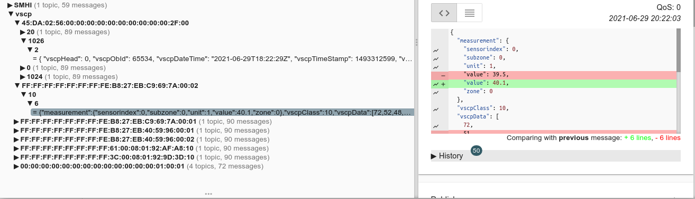

# vscpl2drv-tcpiplink


  * **Available for**: Linux, Windows
  * **Driver Linux**: libvscpl2drv-tcpiplink.so
  * **Driver Windows**: vscpl2drv-tcpiplink.dll

---

The VSCP tcp/ip link driver can send/receive events to/from a remote VSCP tcp/ip link interface with automatic reconnection and security. The remote node is normally a high level VSCP hardware device or a VSCP daemon, either a pre version 15 with built in tcp/ip interface or a version >=15 with the [vscpl2drv-tcpipsrv](https://github.com/grodansparadis/vscpl2drv-tcpipsrv) driver installed.

The driver will try to hold a connection open even if the remote node disconnects. This makes it possible to replace a node or take it down for maintenance and still have the link online again as soon as the node is powered up. 

The VSCP tcp/ip link protocol is described [here](https://grodansparadis.github.io/vscp-doc-spec/#/./vscp_tcpiplink).

With the simple interface the driver uses ([described here](https://grodansparadis.github.io/vscp/#/level_ii_drivers)) it is also possible to use it with other software as a component.

## Install the driver on Linux
You can find binary installation files [here](https://github.com/grodansparadis/vscpl2drv-tcpiplink/releases)

You install the driver using the debian package with

> sudo apt install ./vscpl2drv-tcpiplink_15.0.0.deb

the driver will be installed to the folder _/var/lib/vscp/drivers/level2/_. 

After installing the driver you need to add configuration information for it to the vscpd.conf file (_/etc/vscp/vscpd.json_). Se the *configuration* section below.

You also need to set up the configuration file for the driver. If you don't need to dynamically edit the content of this file a good and safe location for it is in the */etc/vscp/* folder alongside the VSCP daemon configuration file.

If you need to do dynamic configuration (**write** enabled) we recommend that you create the file in the _/var/lib/vscp/_ folder or any location you find to be convenient.

A sample configuration file is available in _/usr/share/vscpl2drv-tcpiplink_ folder after installation. The sample configuration file is named tcpiplink.json.

## Install the driver on Windows
tbd

## How to build the driver on Linux

You need _build-essentials_ and _git_ installed on your system

```bash
sudo apt update && sudo apt -y upgrade
sudo apt install build-essential git
```

To build this driver you to clone the driver source

```bash
git clone --recurse-submodules -j8 https://github.com/grodansparadis/vscpl2drv-tcpiplink.git
```

You also need to have the vscp main repository checkout at the same location as you checkout the driver. Do this with

```bash
git clone --recurse-submodules -j8 https://github.com/grodansparadis/vscp.git
```

The build used **pandoc** for man-page generation so you want the man pages you should install it first with

```
sudo apt install pandoc
```

If you skip it the build will give you some errors (which you can ignore if you don't care about the man page)

Now go into the repository and build the driver

```
cd vscpl2drv-tcpiplink
mkdir build
cd build
cmake .. -DCMAKE_INSTALL_PREFIX=/
make
sudo make install
```

Skip _"-DCMAKE_INSTALL_PREFIX=/"_ if you want the _"local"_ prefix to all install paths except for the driver.

If you want to generate binary packages issue

```bash
sudo cpack
```

Default install folder when you build from source is */var/lib/vscp/drivers/level2*. You can change this with the --prefix option in the make install step. For example 

```
make DESTDIR==/usr/local install
```

to install to */usr/local/var/lib/vscp/drivers/level2*.


## How to build the driver on Windows
tbd

## Configuration

### Linux

#### VSCP daemon driver config

The VSCP daemon configuration file is (normally) located at */etc/vscp/vscpd.json* (For the curious: [VSCP daemon full sample config file for Linux](https://github.com/grodansparadis/vscp/blob/master/resources/linux/vscpd.json)). To use the vscpl2drv-tcpiplink.so driver there must be an entry in the drivers level2 section

```json
"drivers" : {
  "level2" : [
```

with the following format

```json
{
  "enable" : true,
  "name" : "tcpiplink",
  "path-driver" : "/var/lib/vscp/drivers/level2/libvscpl2drv-tcpiplink.so",
  "path-config" : "/etc/vscp/tcpiplink.json",
  "guid" : "FF:FF:FF:FF:FF:FF:FF:F5:99:99:00:00:00:00:00:00",

  "mqtt": {
    "bind": "",
    "host": "test.mosquitto.org",
    "port": 1883,
    "mqtt-options": {
      "tcp-nodelay": true,
      "protocol-version": 311,
      "receive-maximum": 20,
      "send-maximum": 20,
      "ssl-ctx-with-defaults": 0,
      "tls-ocsp-required": 0,
      "tls-use-os-certs": 0
    },
    "user": "vscp",
    "password": "secret",
    "clientid": "the-vscp-daemon",
    "publish-format": "json",
    "subscribe-format": "auto",
    "qos": 1,
    "bcleansession": false,
    "bretain": false,
    "keepalive": 60,
    "bjsonmeasurementblock": true,
    "topic-daemon-base": "vscp-daemon/{{guid}}/",
    "topic-drivers": "drivers",
    "topic-discovery": "discovery",
    "reconnect": {
      "delay": 2,
      "delay-max": 10,
      "exponential-backoff": false
    },
    "tls": {
      "cafile": "",
      "capath": "",
      "certfile": "",
      "keyfile": "",
      "pwkeyfile": "",
      "no-hostname-checking": true,
      "cert-reqs": 0,
      "version": "",
      "ciphers": "",
      "psk": "",
      "psk-identity": ""
    },
    "will": {
      "topic": "vscp-daemon/{{srvguid}}/will",
      "qos": 1,
      "retain": true,
      "payload": "VSCP Daemon is down"
    },
    "subscribe" : [
      {
        "topic": "remote-vscp/{{guid}}/#",
        "qos": 0,
        "v5-options": 0,
        "format": "auto"
      }
    ],
    "publish" : [
      {
        "topic": "vscp/{{guid}}/{{class}}/{{type}}/{{nodeid}}",
        "qos": 1,
        "retain": false,
        "format": "json"
      }
    ]
  }
}
```

##### enable
Set enable to "true" if the driver should be loaded by the VSCP daemon.

##### name
This is the name of the driver. Used when referring to it in different interfaces.

##### path-driver
This is the path to the driver. If you install from a Debian package this will be */var/lib/vscp/drivers/level2/libvscpl2drv-tcpiplink.so*.

##### path-config
This is the path to the driver configuration file (see below). This file determines the functionality of the driver. A good place for this file is in _/etc/vscp/tcpiplink.json_ It should be readable only by the user the VSCP daemon is run under (normally _vscp_) as it holds credentials to log in to a remote VSCP tcp/ip link interface. Never make it writable at this location.

##### guid
All level II drivers must have a unique GUID. There is many ways to obtain this GUID, Read more [here](https://grodansparadis.gitbooks.io/the-vscp-specification/vscp_globally_unique_identifiers.html). The tool [vscp_eth_to_guid](https://grodansparadis.github.io/vscp/#/configuring_the_vscp_daemon?id=think-before-guid) is a useful tool that is shipped with the VSCP daemon that will get you a unique GUID if you are working on a machine with an Ethernet interface.

##### mqtt
See the [VSCP configuration documentation](https://grodansparadis.github.io/vscp/#/configuring_the_vscp_daemon?id=config-mqtt) for info about this section. It is common for all drivers.

#### vscpl2drv-tcpiplink driver config

On start up the configuration is read from the path set in the driver configuration of the VSCP daemon, usually */etc/vscp/conf-file-name* and values are set from this location. If the **write** parameter is set to "true" the above location is a bad choice as the VSCP daemon will not be able to write to it. A better location is */var/lib/vscp/drivername/configure-name.json* or some other writable location.

The configuration file have the following format

```json
{
  "debug" : false,
  "write" : false,
  "key-file": "/var/vscp/vscp.key",
  "encryption" : "none|aes128|aes192|aes256",
  "logging": {
    "console-enable": true,
    "console-level": "trace",
    "console-pattern": "[vcpl2drv-tcpiplink %c] [%^%l%$] %v",
    "file-enable": true,
    "file-log-level": "debug",
    "file-log-path" : "/var/log/vscp/vscpl1drv-tcpiplink.log",
    "file-log-pattern": "[vcpl2drv-tcpiplink %c] [%^%l%$] %v",
    "file-log-max-size": 50000,
    "file-log-max-files": 7
  }, 
  "remote" : {
    "host" : "192.168.1.7",
    "port" : 9598,
    "user" : "admin",
    "password" : "secret",
    "response-timeout": 0
  },
  "tls": {
    "certificate" : "/srv/vscp/certs/tcpip_server.pem",
    "certificate-chain" : "",
    "verify-peer" : false,
    "ca-path" : "",
    "ca-file" : "",
    "verify-depth" : 9,
    "default-verify-paths" : true,
    "cipher-list" : "DES-CBC3-SHA:AES128-SHA:AES128-GCM-SHA256",
    "protocol-version" : 3,
    "ssl_cache_timeout": -1,
    "short-trust" : false
  },
  "filter" : {
    "in-filter" : "incoming filter on string form",
    "in-mask" : "incoming mask on string form",
    "out-filter" : "outgoing filter on string form",
    "out-mask" : "outgoing mask on string form"
  }
}
```

##### debug
Set debug to _true_ to get debug information written to the log file. This can be a valuable help if things does not behave as expected.

##### write
If write is true dynamic changes to the configuration file will be possible to save dynamically to disk. That is, settings you do at runtime can be saved and be persistent. The safest place for a configuration file is in the VSCP configuration folder */etc/vscp/* but for dynamic saves are not allowed if you don't run the VSCP daemon as root (which you should not). Next best place is to use the folder */var/lib/vscp/drivers/level2/configure.json*. A default configuration file is written to [/usr/share/vscp/drivers/level2/vscpl2drv-tcpiplink](/usr/share/vscp/drivers/level2/vscpl2drv-tcpiplink) when the driver is installed.

If you never intend to change driver parameters during runtime consider moving the configuration file to the VSCP daemon configuration folder is a good choice.

##### guid
All level II drivers must have a unique GUID. There is many ways to obtain this GUID, Read more [here](https://grodansparadis.gitbooks.io/the-vscp-specification/vscp_globally_unique_identifiers.html).

##### **remote**

###### host
Remote VSCP tcp/ip link interface host to connect to. IP address or name.

###### port
Port to connect to on VSCP tcp/ip link interface on remote host. Default is 9598.

###### user
Username to login as on VSCP tcp/ip link interface on remote host.

###### password
Password to use on VSCP tcp/ip link interface remote host.

###### response-timeout
Response timeout in milliseconds. Connection will be restarted if this expires.

##### **tls** 
Transport layer security, SSL settings for link. Currently not used.

###### in-filter
Receiving filter. Filter and mask is a way to select which events is received by the driver. A filter have the following format

> priority,vscpclass,vscptype,guid

All values can be give in decimal or hexadecimal (preceded number with '0x'). GUID is always given i hexadecimal (without preceded '0x').

Default setting is

> 0,0,0,00:00:00:00:00:00:00:00:00:00:00:00:00:00:00:00

Read the [vscpd manual](http://grodansparadis.github.io/vscp/#/) for more information about how filter/masks work.

The default filter/mask pair means that all events are received by the driver.

###### in-mask
Receiving mask. Filter and mask is a way to select which events is received by the driver. A mask have the following format

> priority,vscpclass,vscptype,guid

All values can be give in decimal or hexadecimal (preceded number with '0x'). GUID is always given i hexadecimal (without preceded '0x').

The mask have a binary one ('1') in the but position of the filter that should have a specific value and zero ('0') for a don't care bit.

Default setting is

> 0,0,0,00:00:00:00:00:00:00:00:00:00:00:00:00:00:00:00

Read the vscpd manual for more information about how filter/masks work.

The default filter/mask pair means that all events are received by the driver.

###### out-filter
Filter for transmitted data. For more information see _in-filter_ above.

###### out-mask
Mask for transmitted data. For more information see _in-mask_ above.

### Windows
See information from Linux. The only difference is the disk location from where configuration data is fetched.

## Security considerations

### Configuration file

The configuration file for the driver holds host address, username and password for the remote host in un-encrypted form. It therefore must be protected by making it readable only by the person and tools that are allowed to do so. It is recommended to have read rights only for the _vscp_ user on this file.

### TLS/SSL

As TLS/SSL is not supported yet (it will be) in this driver it is important to understand that if used in an open environment like the internet it is not secure. People listening on the traffic can see both data and username/password credentials. It is therefore important to use the driver in a controlled environment and as early as possible move the flow of events to a secure environment like MQTT with TLS activated. This is often not a problem in a local cable based environment but is definitly a problem using wireless transmission that lack encryption.

A solution is to use a SSL wrapper like [this one](https://github.com/cesanta/ssl_wrapper).

##### ssl_certificate
Path to SSL certificate file. This option is only required when at least one of the listening_ports is SSL The file must be in PEM format, and it must have both private key and certificate, see for example ssl_cert.pem. If this option is set, then the webserver serves SSL connections on the port set up to listen on.

**Default**: /srv/vscp/certs/server.pem

##### ssl_certificate_chain
T.B.D.

##### ssl_verify_peer
Enable client's certificate verification by the server.

**Default**: false

##### ssl_ca_path
Name of a directory containing trusted CA certificates for peers. Each file in the directory must contain only a single CA certificate. The files must be named by the subject name’s hash and an extension of “.0”. If there is more than one certificate with the same subject name they should have extensions ".0", ".1", ".2" and so on respectively.

##### ssl_ca_file"
Path to a .pem file containing trusted certificates for peers. The file may contain more than one certificate.

##### ssl_verify_depth
Sets maximum depth of certificate chain. If client's certificate chain is longer than the depth set here connection is refused.

**Default**: 9

##### ssl_default_verify_paths
Loads default trusted certificates locations set at openssl compile time.

**Default**: true

##### ssl_cipher_list
List of ciphers to present to the client. Entries should be separated by colons, commas or spaces.

| Selection	| Description |
| ========= | =========== |
| ALL |	All available ciphers |
| ALL:!eNULL | All ciphers excluding NULL ciphers |
| AES128:!MD5 | AES 128 with digests other than MD5 |

See [this entry in OpenSSL documentation](https://www.openssl.org/docs/manmaster/apps/ciphers.html) for full list of options and additional examples.

**Default**: "DES-CBC3-SHA:AES128-SHA:AES128-GCM-SHA256",

##### ssl_protocol_version
Sets the minimal accepted version of SSL/TLS protocol according to the table:

| Selected protocols | setting |
| ================== | ======= |
| SSL2+SSL3+TLS1.0+TLS1.1+TLS1.2 | 0 |
| SSL3+TLS1.0+TLS1.1+TLS1.2 | 1 |
| TLS1.0+TLS1.1+TLS1.2 | 2 |
| TLS1.1+TLS1.2	| 3 |
| TLS1.2 | 4 |

**Default**: 4.

##### ssl_short_trust
Enables the use of short lived certificates. This will allow for the certificates and keys specified in ssl_certificate, ssl_ca_file and ssl_ca_path to be exchanged and reloaded while the server is running.

In an automated environment it is advised to first write the new pem file to a different filename and then to rename it to the configured pem file name to increase performance while swapping the certificate.

Disk IO performance can be improved when keeping the certificates and keys stored on a tmpfs (linux) on a system with very high throughput.

**Default**: false 

## Using the vscpl2drv-tcpiplink driver

The tcp/ip link driver is useful when you want to link a device that export a [VSCP tcp/ip link interface](https://grodansparadis.github.io/vscp-doc-spec/#/./vscp_tcpiplink). This includes the VSCP daemon software pre version 15 and the VSCP daemon with the [vscl2drv-tcpipsrv](https://github.com/grodansparadis/vscpl2drv-tcpipsrv) driver installed.

More typical the device that export the interface is some other softwarebased solution or a tcp/ip enabled lower end device. What you need is the host address, the port and the username/password needed to login to the host.

The driver can be setup to subscribe to as many MQTT topics as you want. All VSCP event payload types are supported (JSON, XML,string and binary) and you can use _auto_ to let the driver interpret the payload for you. Sending MQTT message payloads containing VSCP events to any of these topics will be result in them being transferred to the remote host if not filtered away by the send filter.

The driver can also publish incoming events to any number of topics. [Topic escapes](https://grodansparadis.github.io/vscp/#/./publishing_server?id=publishing-server-topic-escapes) can be used as for any topic used in the VSCP environment. Typically is to publish to a topic looking something like

```
vscp/{{guid}}/{{class}}/{{type}}/{{nickname}}
```

Before the event is published the topics content will be altered

 * {{guid}} will be replaces by the events GUID. You can use {{srvguid}} to set the server GUID here ot {{ifguid}} to set the drivers GUID.
 * {{class}} will be replaced by the VSCP class for the event. If you prefer it to be expressed as as a hexadecimal number you can use {{xclass}} instead. You can even get the symbolic token by using {{class-token}}.
 * {{type}} will be replaced by the VSCP type for the event. If you prefer it to be expressed as as a hexadecimal number you can use {{xtype}} instead. You can even get the symbolic token by using {{type-token}}.
 * {{nickname}} will be replaced by the two least significant bytes of the event GUID and form an unsigned integer (big-endian as always for VSCP).

 There are endless possibilities here and it gives flexible ways to subscribe to MQTT based events. For example

 If one want everything from a specific device one subscribe to the GUID of the device. Like this

 ```
 vscp/FF:FF:FF:FF:FF:FF:FF:FE:B8:27:EB:C9:69:7A:00:02/#
 ```

 will subscribe to all events from the device with GUID _FF:FF:FF:FF:FF:FF:FF:FE:B8:27:EB:C9:69:7A:00:02_

To limit to just measurements from this device one can subscribe to

```
vscp/FF:FF:FF:FF:FF:FF:FF:FE:B8:27:EB:C9:69:7A:00:02/10/#
```

or all measurements from alla devices

```
vscp/+/10/#
```

Or all temperature measurements

```
vscp/+/10/6/#
```

or all temperature measurements from a specific device

```
vscp/FF:FF:FF:FF:FF:FF:FF:FE:B8:27:EB:C9:69:7A:00:02/10/#
```
you probably understand the flexibility this introduces now.

This is how this looks in the real world for temperature measurements from a device



## Other sources with information

  * The VSCP site - https://www.vscp.org
  * The VSCP document site - https://docs.vscp.org/
  * VSCP discussions - https://github.com/grodansparadis/vscp/discussions


